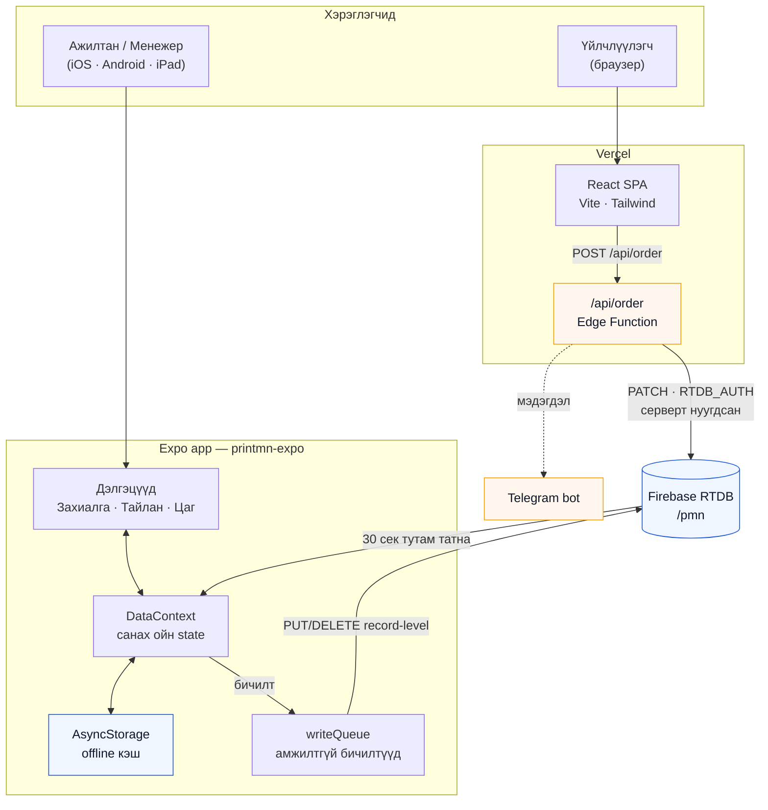
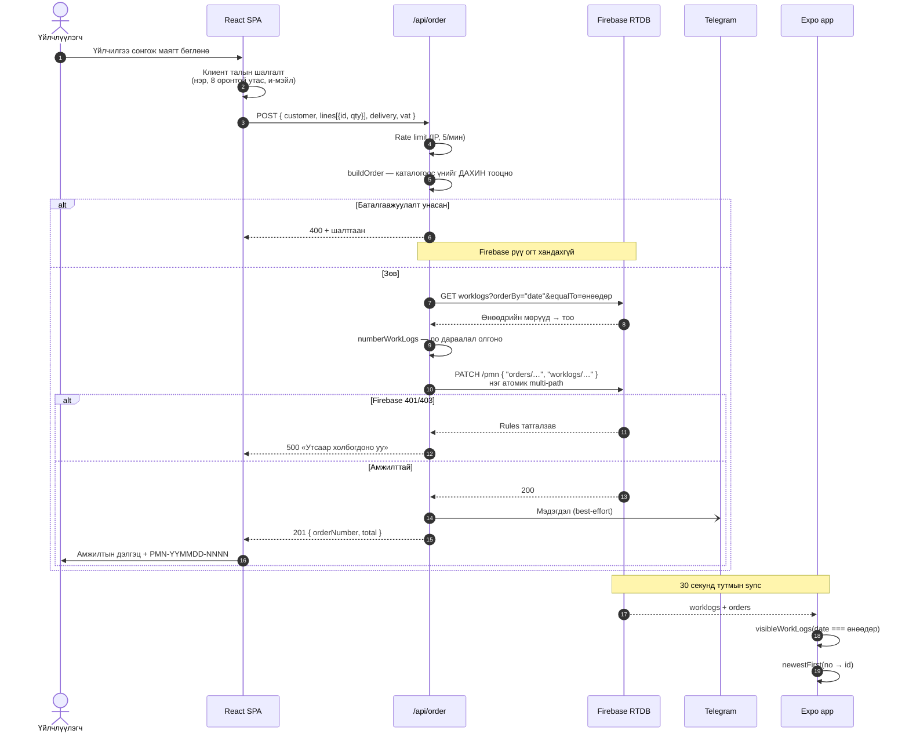
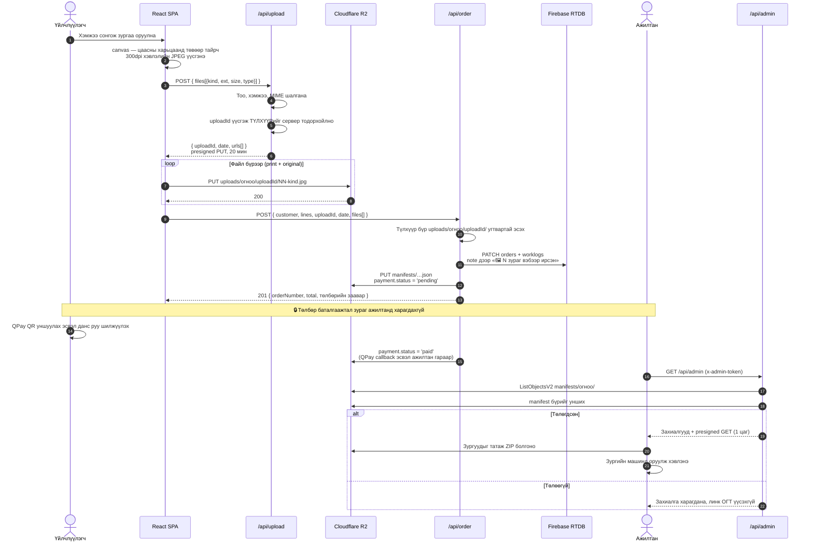
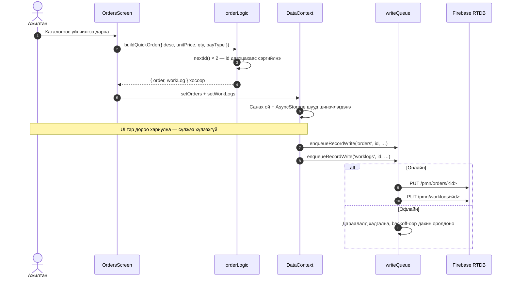
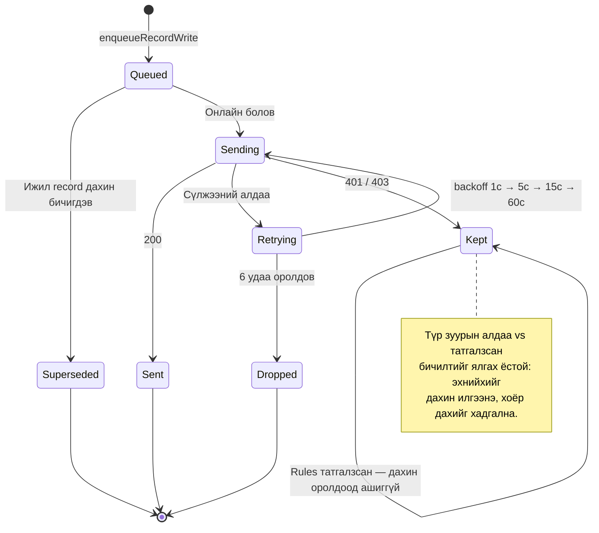
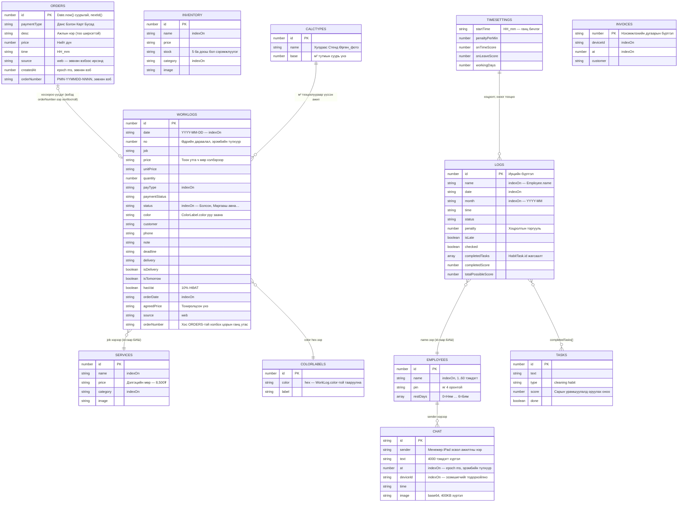
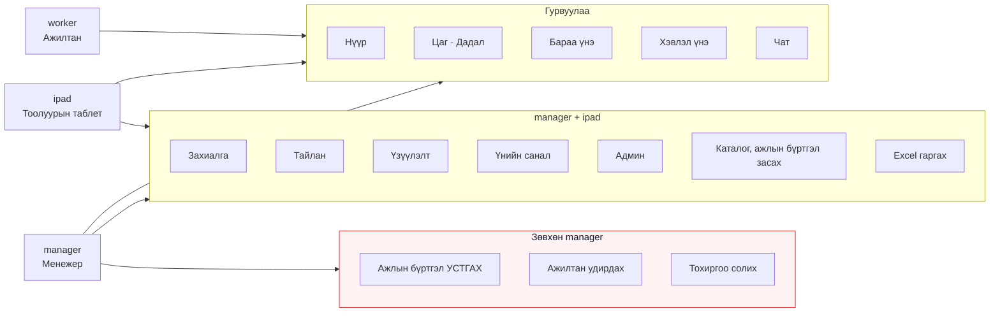

# Printmn — систем бүтэц

`printmn-expo` (native app) ба `konica-web` (вэб) хоёр **нэг л** Firebase
Realtime Database дээр ажилладаг. Энэ баримт нь захиалгын урсгал болон
`/pmn` доторх өгөгдлийн загварыг тайлбарлана.

> Диаграмууд Mermaid хэлбэртэй — GitHub, VS Code дээр шууд рендэрлэгдэнэ.

---

## 1. Систем бүтэц

**Гол зарчим:** browser хэзээ ч Firebase рүү шууд хандахгүй. `RTDB_AUTH` бол
database secret буюу бүрэн admin эрх — bundle-д орвол сайт нээсэн хэн ч
`pmn`-ийг бүхэлд нь уншиж, устгаж чадна.

---

## 2. Вэб захиалгын зам (end-to-end)

### Яагаад ийм алхмууд вэ

| Алхам | Шалтгаан |
| --- | --- |
| Үнийг сервер дээр дахин тооцох | Клиентэд итгэвэл 500₮-ийн ажлыг 1₮-өөр захиалж болно. Зөвхөн тохиролцооны категорид (`Медаль & Цом`, `Хувцас хэвлэл`) хэрэглэгчийн үнийг хязгаарын дотор хүлээж авна |
| Нэг атомик PATCH | Order, WorkLog-ыг тусад нь PUT хийвэл эхнийх нь орж, хоёр дахь нь унаж, орлого чимээгүй алдагдана |
| `no` дараалал | `newestFirst` эхлээд `no`-гоор эрэмбэлдэг — дугааргүй мөр 0 болж жагсаалтын доод талд орно |
| Огноо Улаанбаатарын цагаар | Vercel UTC-ээр явдаг. Локал огноо авбал шөнийн 00:00–08:00-д ирсэн захиалга өмнөх өдрөөр бичигдэж, `date === today` шүүлтүүрээс унана |
| Тооллыг баталгаажуулалтын дараа | Эс тэгвээс хог хүсэлт бүр Firebase рүү нэмэлт ачаалал үүсгэнэ |

---

## 2.1 Зургийн зам — браузераас зургийн машин хүртэл

Хэрэглэгчийн зураг **Firebase рүү огт ордоггүй**. Cloudflare R2 (S3-тэй
нийцтэй) руу браузераас **шууд** очиж, ажилтан `/admin`-аас татаж авдаг.

### Яагаад ийм байдлаар вэ

| Шийдэл | Шалтгаан |
| --- | --- |
| Браузер R2 руу ШУУД PUT | Vercel function-ий хүсэлтийн бие 4.5MB-аар хязгаарлагдсан. Утсаар авсан нэг зураг л ихэвчлэн үүнээс том тул сервер дундуур явуулах боломжгүй |
| Түлхүүрийг зөвхөн сервер тодорхойлно | Клиентээс ирсэн замд итгэвэл дурын хүн `uploads/…/01-print.jpg`-ыг дарж бичих боломжтой |
| `/api/order` дээр угтварыг шалгана | Эс тэгвээс хэн ч бусдын зургийн түлхүүрийг өөрийн manifest-даа бичээд admin хуудсаар татаж авна |
| Индекс R2 дотроо (`manifests/`) | `database.rules.json` нь native app-ын мэдэлд. Шинэ зангилаа нэмбэл rules татгалзаж, захиалга бүхэлдээ унах эрсдэлтэй |
| Зураг байршсаны ДАРАА захиалга бичнэ | Эсрэг дараалал бол зураг унахад ажилтан зураггүй ажлын мөр хараад хэрэглэгч рүү залгах хэрэг гарна. Ингэвэл хэрэглэгч дахин оролдоод л болно |
| Manifest унасан ч 201 буцаана | Захиалга аль хэдийн Firebase-д орсон. Алдаа буцаавал хэрэглэгч дахин илгээж, орлого давхардана. Оронд нь Telegram дээр анхааруулна |
| `print` + `original` хоёуланг хадгална | Хэрэглэгч гар аргаар тайрдаггүй тул автомат тайралт чухал хэсгийг таслах эрсдэлтэй. Эх файлаас ажилтан дахин бэлдэнэ |
| Bucket нийтэд хаалттай | Бүх хандалт 20 мин (PUT) / 1 цаг (GET) амьдардаг presigned URL-ээр. Линк алдагдсан ч бүхэл сан задрахгүй |
| Төлбөрийн түгжээ нь **линк олгох** үе шат дээр | Интерфейс дээр товч идэвхгүй болгох нь хамгаалалт биш — DevTools нээсэн хэн ч тойрно. Presigned URL нь сервер дээр, төлбөр шалгасны дараа л үүснэ |
| Зураг төлбөрөөс ӨМНӨ байрших | Хэрэглэгч банкны апп руу шилжих үед браузер хаагдвал файл алдагдана. Байршуулчихаад линкийг түгжих нь илүү тэсвэртэй |
| QPay callback-д итгэхгүй, `payment/check` дуудна | Callback бол нийтэд нээлттэй хаяг — хэн ч дуудаж «төлөгдлөө» гэж бичүүлэх боломжтой |

---

## 3. Апп доторх шуурхай захиалга

Харьцуулбал: апп дээр каталогоос дарахад `buildQuickOrder` мөн адил **хос**
бичлэг үүсгэдэг. Ялгаа нь бичилт нь дараалалд ордогт оршино.

---

## 4. Офлайн бичилтийн дараалал

---

## 5. Өгөгдлийн загвар — `/pmn`

Firebase RTDB бол баримт бичгийн сан — **гадаад түлхүүр албадан хэрэгждэггүй**.
Доорх холбоосууд нь кодоор баримталдаг зохицол, сан өөрөө шалгадаггүй.

### Анхаарах зүйлс

- **`ORDERS ↔ WORKLOGS` холбоо сул.** Апп дээр `buildQuickOrder` хоёр бичлэгийг
  тус тусын `id`-тайгаар үүсгэдэг — хооронд нь заасан талбар байхгүй. Зөвхөн
  вэбээс ирсэн хос `orderNumber`-ээр холбогдоно. Хэрэв ирээдүйд тохируулга
  (reconciliation) хэрэгтэй бол апп талд ч мөн адил талбар нэмэх нь зөв алхам.
- **Үнэ мөр хэлбэртэй.** `'8,500₮'` гэж хадгалагддаг тул тооцоо бүр
  `parsePrice()`-аар дамжина (тоо биш бүх тэмдэгтийг хасаад `Number`).
- **`WORKLOGS.job` нь чөлөөт текст.** `SERVICES`-ийн нэрээс хуулагддаг ч
  түүхий мөр — үйлчилгээний нэр өөрчлөгдвөл хуучин ажлын бүртгэл хэвээр үлдэнэ.
  Тайланд энэ нь давуу тал (түүх гажихгүй), нэгтгэлд сул тал.
- **`LOGS.name → EMPLOYEES.name`.** Ажилтны нэр солигдвол өмнөх ирцийн бүртгэл
  тасарна. `id`-гаар холбох нь илүү найдвартай.
- **`INVENTORY` ба `SERVICES` тусдаа.** Эхнийх нь агуулахын үлдэгдэлтэй бараа,
  хоёр дахь нь үйлчилгээний үнэ. Вэб зөвхөн `SERVICES`-ийг ашигладаг.
- **`TIMESETTINGS` ганц бичлэг** — жагсаалт биш, `/pmn/timesettings` шууд объект.

---

## 6. Эрхийн хуваарилалт

`permissions.ts → MATRIX` дээрх бодит эрхүүд:

Хоёр зүйл онцлох нь зүйтэй:

- Вэбээс ирсэн захиалга **Захиалга** таб дээр гарна — тэр таб `worker`-т
  байхгүй тул зөвхөн `manager` / `ipad` харна.
- Ажлын бүртгэл **устгах** нь зөвхөн `manager`-т. Захиалга бүртгэх, засах нь
  тоолуурын ажил, устгах нь тийм биш: устгасан мөр өдрийн орлогыг өөртэйгөө
  хамт аваад явдаг бөгөөд апп-д буцаах арга байхгүй.

---

## 7. Хаанаас юу уншихад тохиромжтой

| Асуулт | Файл |
| --- | --- |
| Захиалга Firebase рүү яаж бичигддэг вэ | `konica-web/api/order.ts`, `api/_shared.ts` |
| Апп доторх шуурхай захиалга | `printmn-expo/src/features/orders/orderLogic.ts` |
| Самбарын шүүлт, эрэмбэ | `printmn-expo/src/features/worklogs/workLogLogic.ts` |
| Офлайн дараалал | `printmn-expo/src/services/sync/writeQueue.ts` |
| Rules ба индексүүд | `printmn-expo/firebase/database.rules.json` |
| Үнийн тооцоо, НӨАТ | `printmn-expo/src/utils/price.ts`, `konica-web/src/lib/price.ts` |
